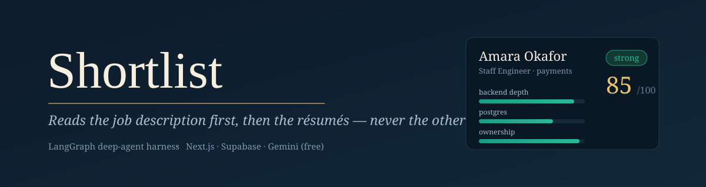
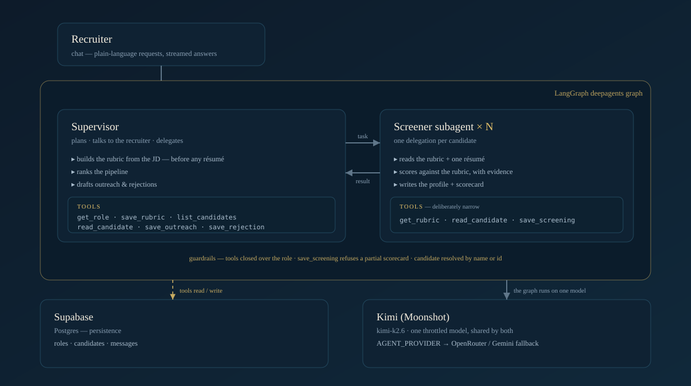
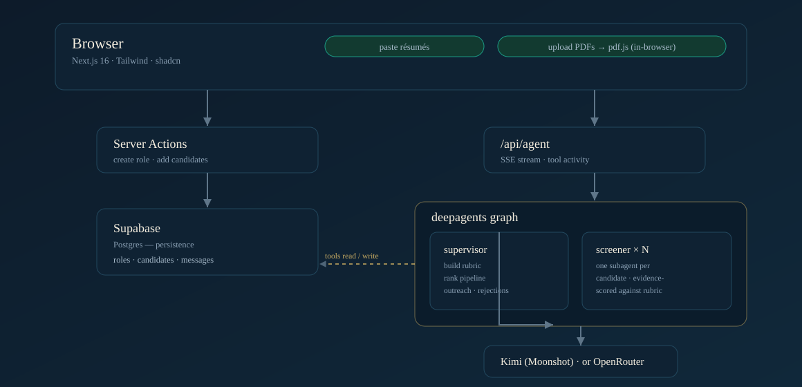

<p align="center">
  
</p>

<h1 align="center">Shortlist — Résumé Screening Desk</h1>

<p align="center"><em>Reads the job description first, then the résumés — never the other way round.</em></p>

<p align="center">
  <a href="https://shortlist-screening-desk.vercel.app"></a>
  
  
  
  
  
</p>

**Shortlist** is a custom AI agent for **in-house technical recruiters**. Paste a job
description and it writes a defensible **scoring rubric from the JD** *before it reads a single
résumé*, then screens a batch — producing an **evidence-cited scorecard**, risk flags phrased
as questions to ask on a screen, a ranked shortlist, and personalised **outreach / rejection
drafts**. Résumés go in by paste or by **uploading PDFs — or a whole folder**.

> The product's output is *an argument about a person, backed by evidence*. Every score on
> screen is one click from the quoted résumé line behind it — the interface never shows a
> number you can't interrogate.

**🔗 Live:** <https://shortlist-screening-desk.vercel.app> &nbsp;·&nbsp; **Repo:** <https://github.com/Usman1Abbas/shortlist-screening-desk>

> Open the live link and click the seeded **“Founding AI / Agent Engineer — Z360”** role: a
> fully-screened pipeline (rubric, evidence-scored candidates, an outreach and a rejection
> draft) renders instantly — no setup, no API key needed to review it.

---

## ✨ What it does

- **Builds a rubric from the JD.** Hard must-haves + 3–8 weighted criteria pulled from what the
  role actually asks for, plus a calibration note for how “senior” should read *for this role*.
  Nothing gets scored until a rubric exists.
- **Screens résumés against that one rubric.** One screener subagent per candidate → a structured
  profile and a per-criterion scorecard with a **quote of evidence** for every criterion.
- **Ranks the pipeline.** Overall 0–100, a `strong / maybe / no` verdict, and risk flags written
  as **questions a recruiter can ask on the phone screen** — never as rejections.
- **Drafts outreach & rejections.** Personalised outreach for strong candidates; warm,
  reason-light rejections for the rest. All **drafts, human-reviewed** — nothing is auto-sent.
- **Two ways in.** Paste résumés, or **upload PDFs / an entire folder** — text is extracted in
  the browser and flows into the same pipeline.

---

## 🧠 The harness (a real deep agent, not a chatbot)

A [LangGraph **`deepagents`**](https://github.com/langchain-ai/deepagentsjs) graph: a
**supervisor** that plans and talks to the recruiter, delegating each résumé to a **screener
subagent** that handles one candidate at a time.

<p align="center">
  
</p>

- **Domain knowledge** ([`lib/agent/prompt.ts`](lib/agent/prompt.ts)) — the opinionated core:
  *score evidence over adjectives* (“cut p99 800ms→120ms by resharding” beats “expert in
  distributed systems”), *scope over title*, *absence of evidence ≠ evidence of absence*, and
  hard **bias guardrails** (never infer age, gender, ethnicity, nationality, health, or schooling).
- **Delegation** ([`lib/agent/index.ts`](lib/agent/index.ts)) — the screener subagent gets a
  deliberately **narrow tool surface**; one delegation per candidate keeps résumé twelve as
  well-read as résumé one, instead of the supervisor compressing later candidates into vibes.
- **Guardrails** — tools are **built per request and closed over the role**, so a score can't
  land on the wrong pipeline; `save_screening` **rejects a partial scorecard** rather than
  persisting an unreadable overall number.

---

## 🏗️ Architecture

<p align="center">
  
</p>

Résumés enter by paste or in-browser PDF extraction; server actions persist to Supabase; the
chat hits `/api/agent`, which streams a **deepagents** graph — a supervisor delegating each
candidate to a screener subagent — whose tools read and write straight back to Supabase, so the
UI just re-reads the pipeline.

**Stack** — Next.js 16 (App Router) · Tailwind v4 · shadcn/ui · Supabase (Postgres) ·
LangGraph `deepagents` on **Kimi** (Moonshot `kimi-k2.6`) by default (`AGENT_PROVIDER=openrouter` or
`=gemini` swaps to a fallback) ·
streaming SSE endpoint that surfaces tool activity as recruiter-readable verbs and aborts the run
if the client disconnects.

---

## 🧰 Tools

| Tool | Surface | What it does |
|---|---|---|
| `get_role` | supervisor | Read the JD, current rubric, and candidate roster |
| `get_rubric` | subagent | Read the rubric — must-haves, weighted criteria, calibration (the JD, distilled; no full JD or roster) |
| `save_rubric` | supervisor | Create/replace the weighted rubric |
| `list_candidates` | supervisor | Read the whole ranked pipeline |
| `read_candidate` | supervisor + subagent | Read one résumé's full text |
| `save_screening` | subagent | Write the profile and scorecard together — **rejected if it skips any rubric criterion** |
| `save_outreach` | supervisor | Save a personalised outreach draft (strong candidates) |
| `save_rejection` | supervisor | Save a warm, reason-light rejection draft (passed-over candidates) |

---

## 🚀 Run it locally

**Prerequisites** — Node 20+ · a [Supabase](https://supabase.com) project · a
[Kimi / Moonshot](https://platform.moonshot.ai/console/api-keys) API key — or OpenRouter / Gemini.

**1. Configure environment**
```bash
cp .env.local.example .env.local
```
```bash
MOONSHOT_API_KEY=sk-...                             # agent runs on Kimi (Moonshot) by default
# KIMI_MODEL=kimi-k2.6                              # optional; also kimi-k2.5 / kimi-k2.7-code / kimi-k3
# KIMI_BASE_URL=https://api.moonshot.ai/v1          # optional; use api.moonshot.cn for the China platform
OPENROUTER_API_KEY=sk-or-...                        # fallback (AGENT_PROVIDER=openrouter)
SUPABASE_URL=https://<your-project>.supabase.co
SUPABASE_SERVICE_ROLE_KEY=<service_role secret>    # server-only, never expose
```

**2. Create the database** — run this in the Supabase SQL editor:
```sql
create table if not exists roles (
  id uuid primary key default gen_random_uuid(),
  title text not null, company text not null, jd_text text not null,
  rubric jsonb, created_at timestamptz not null default now()
);
create table if not exists candidates (
  id uuid primary key default gen_random_uuid(),
  role_id uuid not null references roles(id) on delete cascade,
  label text not null, raw_resume text not null,
  profile jsonb, score jsonb, outreach jsonb, rejection jsonb,
  created_at timestamptz not null default now()
);
create table if not exists messages (
  id uuid primary key default gen_random_uuid(),
  role_id uuid not null references roles(id) on delete cascade,
  role text not null check (role in ('user','assistant')),
  content text not null, created_at timestamptz not null default now()
);
create index if not exists candidates_role_id_idx on candidates(role_id);
create index if not exists messages_role_created_idx on messages(role_id, created_at);
-- All access is server-side via the service_role key, so lock RLS down with no policies.
alter table roles enable row level security;
alter table candidates enable row level security;
alter table messages enable row level security;
```

**3. Install & run**
```bash
npm install
npm run dev          # http://localhost:3000
```
Open a role, add résumés (paste or upload PDFs), then tell the desk
*“Build the rubric and screen everyone.”*

**Scripts**
```bash
npx tsx scripts/smoke.ts          # end-to-end: rubric → screen fixtures → ranked pipeline
npx tsx scripts/seed-demo.ts      # seed a fully-screened demo role (no model calls)
npx tsx scripts/pdf-test.ts       # PDF extraction unit tests
```

**Deploy (Vercel)** — import the repo, set the env vars above in Project → Settings, deploy.
Persistence lives in Supabase, so the serverless runtime holds no state.

---

## 🗂️ Data model ([`lib/types.ts`](lib/types.ts))

- **Role** — `title`, `company`, `jdText`, `rubric` (`mustHaves`, weighted `criteria`, `calibration`)
- **Candidate** — `label`, `rawResume`, `profile`, `score` (`overall`, `verdict`, per-criterion
  `breakdown` with evidence, `risks`, `rationale`), `outreach`, `rejection`
- **ChatMessage** — the recruiter ↔ desk transcript per role

Design intent and tone are documented in [`.impeccable.md`](.impeccable.md).

---


---

## 🔭 What I'd build next

- **Multi-user auth** with per-recruiter data scoping (Supabase Auth + real RLS policies),
  replacing the current single-tenant service-role access.
- **Store original PDFs** in Supabase Storage so a recruiter can open the source file, and add
  **OCR** for scanned/image-only résumés (currently skipped).
- **Scoring evals** — a regression suite that checks the same résumé + rubric yields a consistent
  score, to catch drift when the model or prompt changes.
- **Outreach send integration** (Gmail/Outlook) instead of draft-only, and **dedup** of the same
  candidate across roles.
